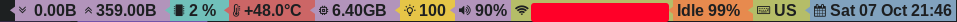

# DWMBAR - Status Bar for DWM

DWMBAR is a convenient utility for displaying information in the status bar of the **DWM** window manager.

---

## Installation

### Build

To build, use the command:
```sh
make build
```
**Requirements:**
- **dwm-status2d** patch
- **Nerd Fonts** package (`media-fonts/nerd-fonts-symbols` on Gentoo, `nerd-fonts-git` on arch)

**Or install:**
```sh
sudo make install
```
**Or for local installation:**
```sh
make install_local
```
(The file will be installed in `~/.dwm/bin/dwmbar`)

---

## Autostart on DWM launch
Add to your **xinitrc**:
```sh
~/.dwm/bin/dwmbar
```
If `sudo make install` was used, simply add:
```sh
dwmbar
```

---

## Run Examples

### Displaying only time

#### Russian Language
```sh
dwmbar --noBrightness -noCpu -noLang -noMemory -noNetworkStats -noWeather -noNetworkState -noPowerState -noTemp -noVolume -noNotificationsState -enableNotificationsStateBgBlinking --lang=ru
```

#### English Language
```sh
dwmbar --noBrightness -noCpu -noLang -noMemory -noNetworkStats -noWeather -noNetworkState -noPowerState -noTemp -noVolume -noNotificationsState -enableNotificationsStateBgBlinking --lang=en
```

---

## Screenshot


---

## Project Structure

- **[drawer](drawer)** — renders the final bar
- **[drawer_templates](drawer_templates)** — templates for `fmt.Sprintf`
- **[drawer_theme](drawer_theme)** — utilities for creating themes
- **[metrics_collector](metrics_collector)** — collects data using `state_providers`
- **[snapshot](snapshot)** — stores current state
- **[state_providers](state_providers)** — low-level handlers (commands, libraries)
- **[themes](themes)** — predefined themes
- **[util](util)** — utility functions

---

## Workflow

The utility consists of two main modules:
1. **Data Collection:**
   - `metrics_collector` → `state_providers` → OS (data request)
2. **Rendering the Status Bar:**
   - `drawer` → `drawer_templates` + `drawer_theme` → OS (output to status bar)

---

## Components

### State Providers

- **Battery:** `github.com/distatus/battery`
- **Screen Brightness:** `brightnessctl`
- **CPU Load:** `github.com/mackerelio/go-osstat/cpu`
- **CPU Temperature:** `github.com/ssimunic/gosensors`
- **Keyboard Layout:** `xkblayout-state`
- **Network State:** `/sys/class/net/`, `iwctl`
- **Network Statistics:** `github.com/mackerelio/go-osstat/network`
- **Notifications:** `dunstctl`
- **Volume Control:** `github.com/itchyny/volume-go`
- **Weather temperacure** `ifconfig.me`, `openmetio`, `openstreetmap`  

### Status Bar Rendering

- The `xsetroot` command is used to output the string to the DWM status bar

---

## Supported Platforms

- **OS:** Linux, X11, DWM
- **Network Daemons:** iwd, NetworkManager, wpa_supplicant
- **Notifications:** dunst
- **Fonts:** `media-fonts/nerd-fonts-symbols` (Gentoo), `nerd-fonts-git` (aur)
- **Patches:** `dwm-status2d`

